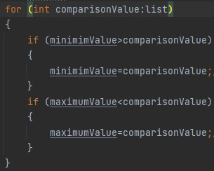

### En büyük en küçük değeri bulma
Bu readme dosyasında ilgili projeye ait 
detaylar anlatılacaktır




#### Ne anlatıyor?

Projedeki detay kısım burası 

```java
for(int comporisonValue:list)
    -kısmında karşılaştırma operatörümüz foreach ile
     ilgili listemize bağlanmıştır
        
        
 if (minimimValue>comparisonValue)
{
  minimimValue=comparisonValue;
}
   -kısmında ise atanan ilk minimum değer listenin 
   en başındaki değerden başlayıp en sona kadar kontrol
   sağlıyor eğer daha küçük değer sağlanıyorsa atama 
  gerçekleşiyor


   if (maximumValue<comparisonValue)
    {
     maximumValue=comparisonValue;
    }
   yukarıdaki en küçük elemanı bulma mantığı ile aynıdır
```
 #### Çalışma mantığı
Çalışma mantığı şu sekildedir

Önce minimum ve maximum değere listedeki ilk eleman eklenir
ardından bir sonraki elemanla kontrol edilir ve eleman
eğer  ilk elamandan küçükse en küçük elemana veya 
en büyük elemana aktarılır
ardından bir sonraki elamanla konrol sağlanır
böylece hem çif for döngüsü yapmaya gerek kalmaz
hem de zamandan tasarruf sağlanır

İşlemlerin fonksiyonda yapılmasının sebebi ise ileride 
yine bir listenin max ve min değerleri bulunacaksa
tekrar aynı kodları yazmak yerine 
direkt olarak fonksiyonu çağırmak 